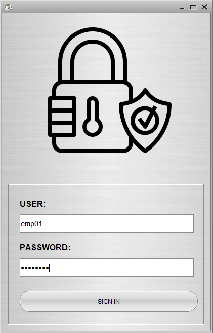
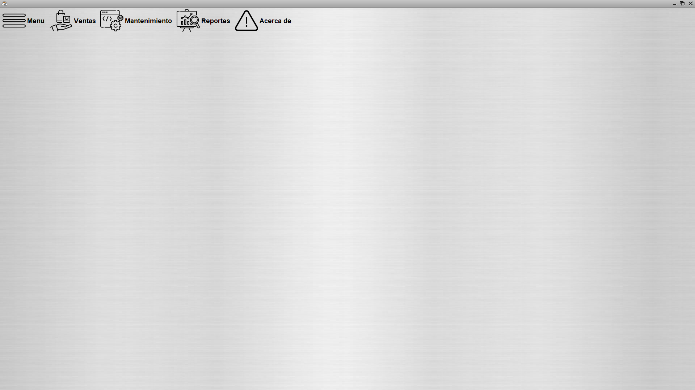
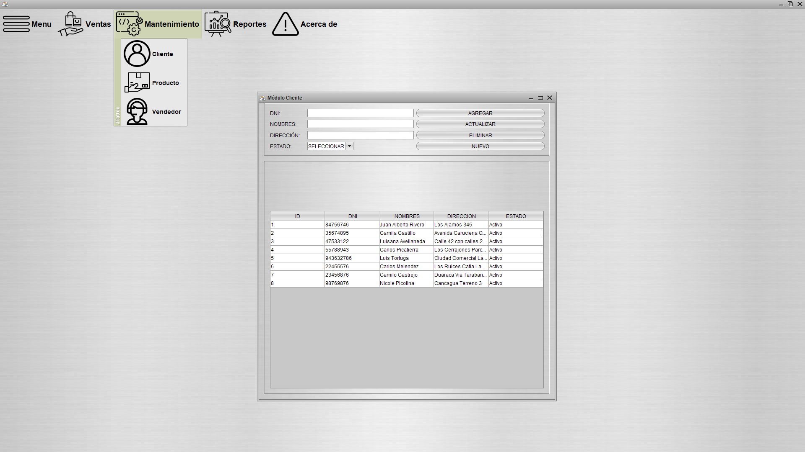
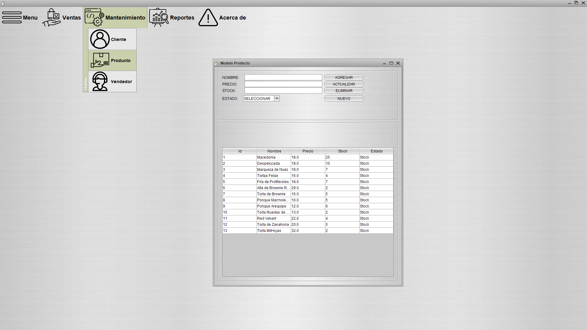
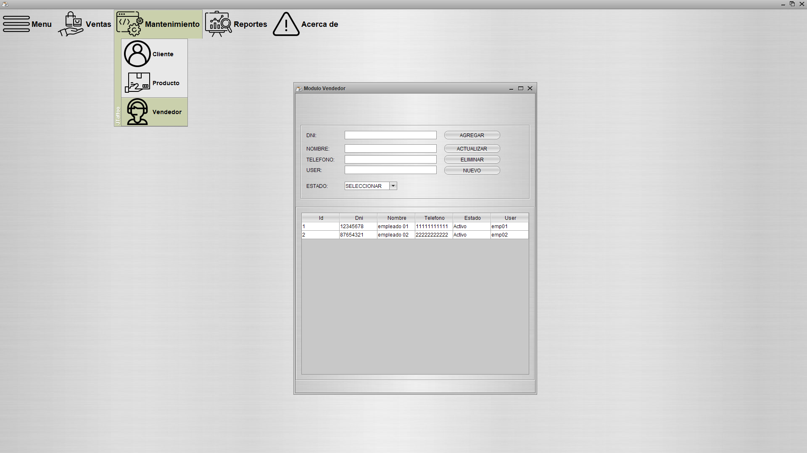
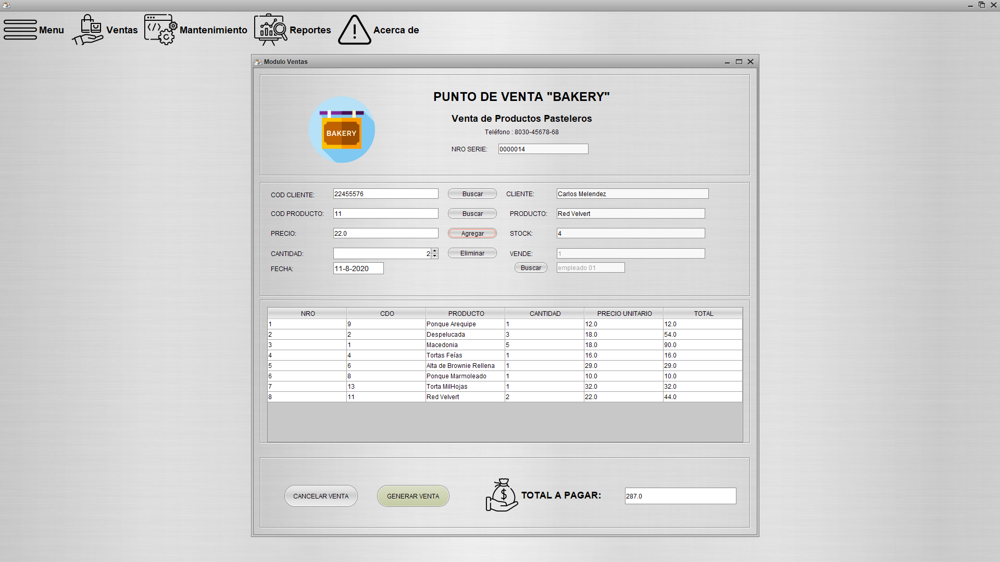
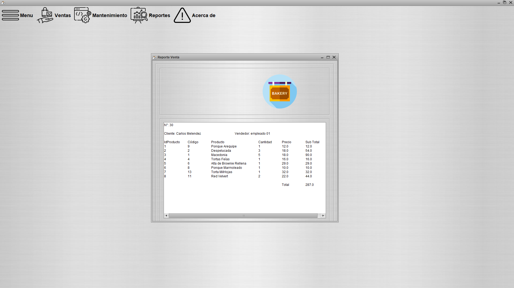
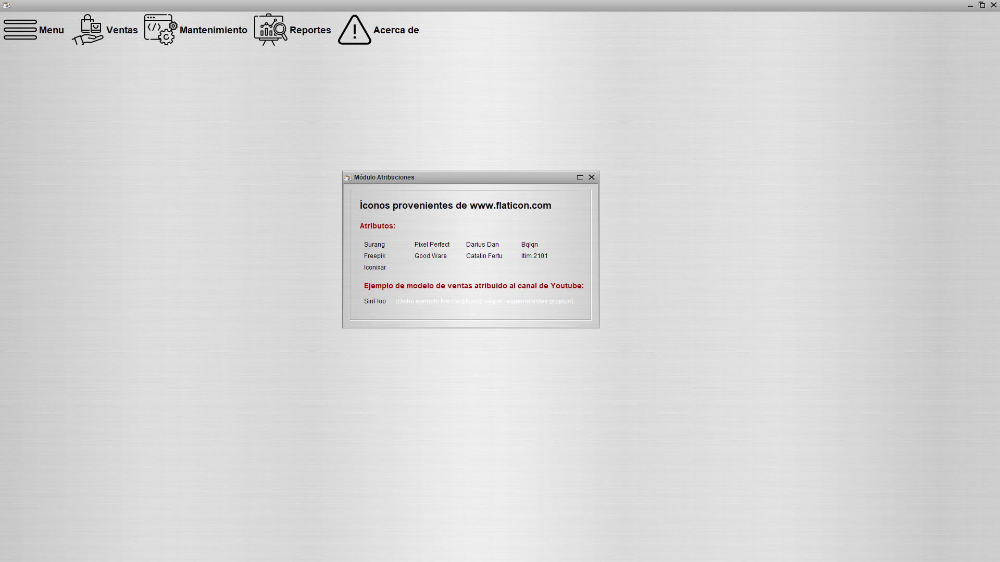

# Sistema de Ventas Java

_Java 8 y Mysql 8_

## Comenzando 🚀

### Login

### Pantalla principal🔧

### Mantenimiento cliente📋

### Mantenimiento producto📋

### Mantenimiento vendedor📋

## Ejecutando las pruebas ⚙️

### Registro venta

### Venta Realizada con Exito

### Reporte venta

## Construido con 🛠️

* [NetBeans](https://netbeans.org/community/releases/82/) - El framework web usado
* [Mysql](https://www.mysql.com/) - Manejador de base de datos
* [Xampp](https://www.apachefriends.org/es/index.html)

## Atribuciones 📌

